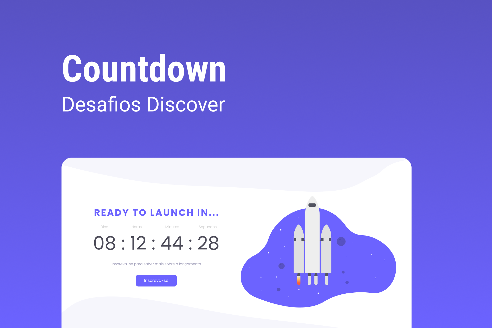

<h1 align="center"> CountDown </h1>

Desafio gratuito promovido pela Rocketseat para ensino de tecnologias WEB.

  <a href="#-tecnologias">Tecnologias</a>&nbsp;&nbsp;&nbsp;|&nbsp;&nbsp;&nbsp;
  <a href="#-projeto">Projeto</a>&nbsp;&nbsp;&nbsp;|&nbsp;&nbsp;&nbsp;
  <a href="#-layout">Layout</a>&nbsp;&nbsp;&nbsp;|&nbsp;&nbsp;&nbsp;
  <a href="#memo-licença">Licença</a>

  

 

  

## 🚀 Tecnologias

Esse projeto foi desenvolvido com as seguintes tecnologias:

- HTML e CSS
- JavaScript
- Git e GitHub

## 💻 Projeto

O countDown é um app que funciona como visualização do tempo restante para certo evento

## 🔖 Layout

Você pode visualizar o projeto através [DESSE LINK](https://nesdark.github.io/countdown/).

## :memo: Licença

Esse projeto está sob a licença MIT.

---

Feito com ♥ by Christian :wave: [Participe da comunidade de Devs da Rocketseat ](https://discord.gg/rocketseat)
